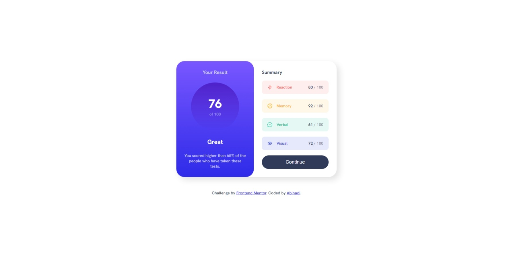

# Frontend Mentor - News homepage solution

This is a solution to the [News homepage challenge on Frontend Mentor](https://www.frontendmentor.io/challenges/news-homepage-H6SWTa1MFl). Frontend Mentor challenges help you improve your coding skills by building realistic projects. 

## Table of contents

- [Overview](#overview)
  - [The challenge](#the-challenge)
  - [Screenshot](#screenshot)
  - [Links](#links)
- [My process](#my-process)
  - [Built with](#built-with)
  - [What I learned](#what-i-learned)
  - [Continued development](#continued-development)
- [Author](#author)

**Note: Delete this note and update the table of contents based on what sections you keep.**

## Overview

### The challenge

Users should be able to:

- View the optimal layout for the interface depending on their device's screen size
- See hover and focus states for all interactive elements on the page

### Screenshot

### Links

- Solution URL: [https://github.com/Devon107/News-Hompage-Main](https://github.com/Devon107/News-Hompage-Main)
- Live Site URL: [https://devon107.github.io/News-Hompage-Main/](https://devon107.github.io/News-Hompage-Main/)

## My process

### Built with

- Semantic HTML5 markup
- CSS custom properties
- Flexbox
- CSS Grid
- Mobile-first workflow

### What I learned

I've just practiced more with CSS grid y flex

### Continued development

I will be doing more challenges and exercises to master js and then go to the next step with Node.js to build web apps.

## Author

- Website - [Abinadi](https://www.frontendmentor.io/profile/Devon107)
- Frontend Mentor - [@Devon107](https://www.frontendmentor.io/profile/Devon107)

